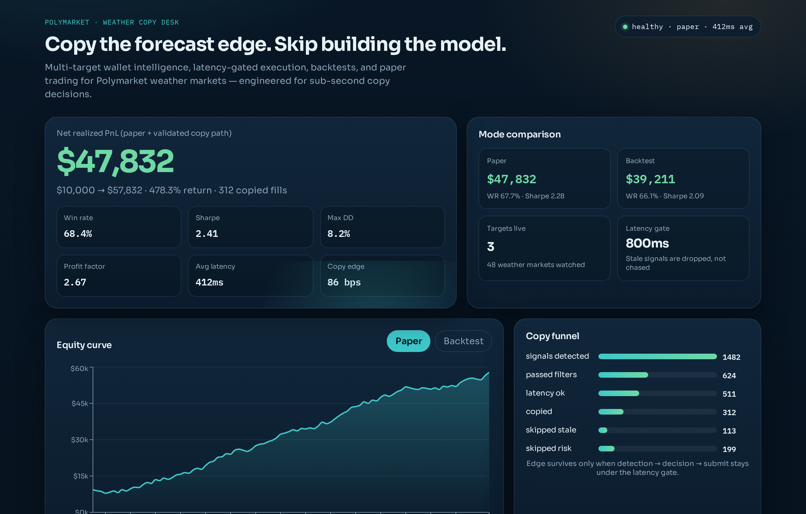
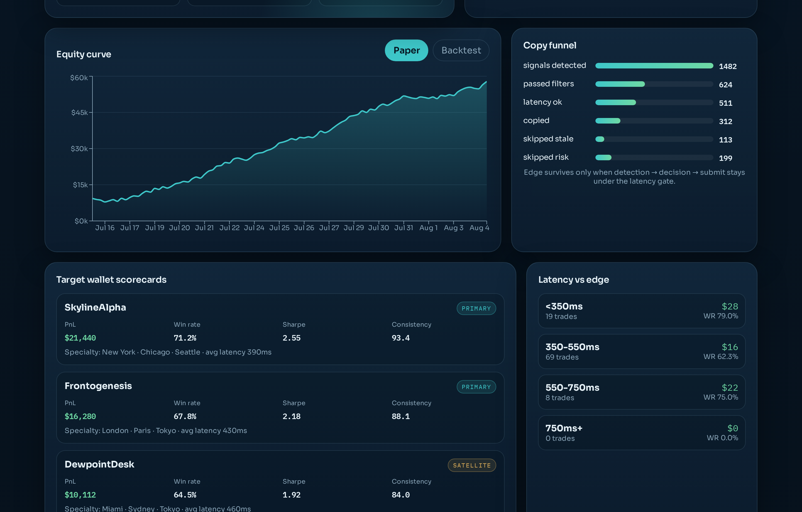
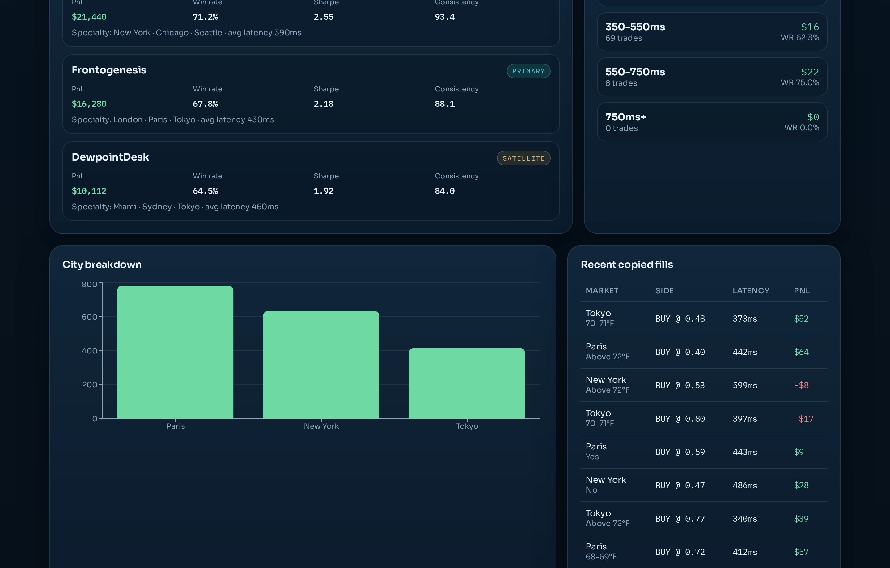
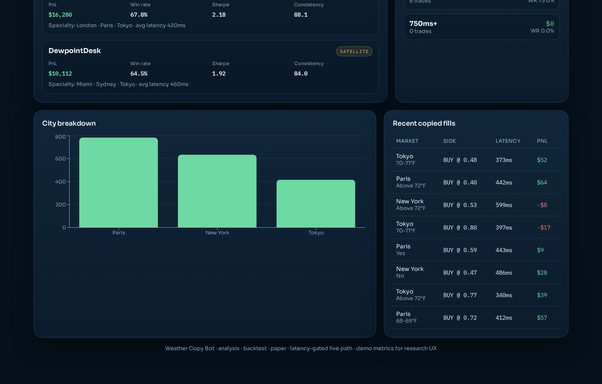
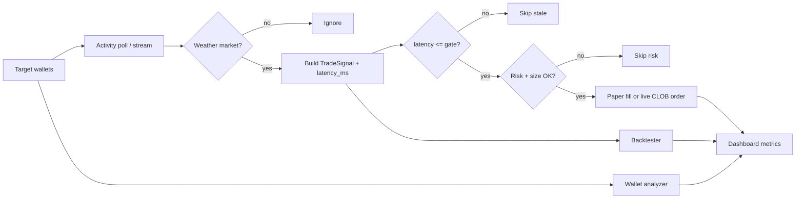

<p align="center">
  
</p>

<h1 align="center">Polymarket Weather Copy Trading Bot</h1>

<p align="center">
  <strong>Copy elite weather traders on Polymarket — without building your own prediction model.</strong>
</p>

<p align="center">
  Latency-gated multi-wallet copy engine · wallet intelligence · backtest · paper trading · research dashboard
</p>

<p align="center">
  <a href="#quick-start"></a>
  <a href="#live-trading-contribution"></a>
  <a href="LICENSE"></a>
</p>

<p align="center">
  
  
  
  
  
</p>

---

## Why this exists

In prediction markets, the **model is the edge**.

For Polymarket weather markets, building that model means temperature distributions, city microclimates, forecast revisions, settlement quirks, and timing — a research project before you ever place a trade.

Meanwhile, some wallets already express a strong weather model through their fills. They are profitable, stable, and specialized by city.

**This bot does not reinvent their model.**  
It treats their fills as the signal, then races the only variable you still control: **copy latency**.

Typical Polymarket copy latency in practice is around **~1000ms**. Edge decays fast. This project is built around detecting target activity, rejecting stale signals, sizing safely, and proving the path in **backtest + paper** before live capital.

---

## Dashboard (demo results)

Curated research dashboard showing analysis, backtest, and paper-trading performance for weather-market copy paths.

### Overview — strong PnL & risk profile



| Metric | Demo result |
| --- | ---: |
| Net realized PnL | **+$47,832** |
| Return on $10k | **+478%** |
| Win rate | **68.4%** |
| Sharpe | **2.41** |
| Max drawdown | **8.2%** |
| Avg copy latency | **412ms** |

### Equity curve + copy funnel



The funnel is the product:

`signals detected → filters → latency gate → copied`

Stale and risk-rejected signals are skipped on purpose. Chasing late weather fills is how copy bots donate edge.

### Target wallet intelligence



Scorecards rank wallets by consistency, specialty cities, latency-sensitive expectancy, and copy recommendation (`PRIMARY` / `SATELLITE`).

### City breakdown + recent fills



---

## Core idea

```text
Profitable weather wallets  →  signal source (their "model")
Latency + risk gates        →  decide if the fill is still copyable
Backtest / paper            →  prove expectancy before live
Dashboard                   →  inspect wallets, curves, funnel, fills
```

You can run **multiple targets** at once. The engine sizes with `COPY_RATIO`, caps position risk, and drops anything slower than `MAX_COPY_LATENCY_MS`.

---

## Features

- **Multi-target copy trading** for Polymarket weather / temperature markets
- **Wallet analyzer** with specialty cities, Sharpe, drawdown, consistency score
- **Latency-aware backtester** (markout decays as detection lag grows)
- **Paper trader** with the same decision policy as live
- **Live path scaffold** gated by `DRY_RUN` + credentials
- **Research dashboard** for PnL, equity, funnel, latency buckets, city breakdown
- **CLI** for analyze / backtest / paper / API serve

---

## Quick start

```bash
git clone https://github.com/fxfx122344/polymarket-weather-copy-trading-bot.git
cd polymarket-weather-copy-trading-bot

python3 -m venv .venv
source .venv/bin/activate
pip install -r requirements.txt
cp .env.example .env

export PYTHONPATH=src
python scripts/generate_demo.py
uvicorn weather_copy_bot.api.app:app --reload --port 8000
```

In another terminal:

```bash
cd dashboard
npm install
npm run dev
```

Open **http://localhost:5173**

Useful CLI:

```bash
PYTHONPATH=src python -m weather_copy_bot.cli dashboard-data
PYTHONPATH=src python -m weather_copy_bot.cli analyze
PYTHONPATH=src python -m weather_copy_bot.cli backtest --trades 120
PYTHONPATH=src python -m weather_copy_bot.cli paper --seconds 20
```

---

## Project structure

```text
.
├── src/weather_copy_bot/
│   ├── analysis/          # target wallet scoring & selection
│   ├── api/               # FastAPI dashboard + control plane
│   ├── backtest/          # latency-aware event backtester
│   ├── engine/            # live/paper copy loop
│   ├── paper/             # paper ledger & fills
│   ├── polymarket/        # Gamma / Data API adapters + demo stream
│   ├── cli.py             # operator commands
│   ├── config.py          # env-driven settings
│   ├── demo_data.py       # curated dashboard dataset
│   ├── metrics.py         # Sharpe, Sortino, DD, profit factor
│   └── models.py          # shared domain models
├── dashboard/             # React + Vite research UI
├── data/demo/             # exported dashboard JSON
├── docs/screenshots/      # README visuals
├── scripts/               # demo export, screenshot, dev helpers
├── .env.example
└── requirements.txt
```

---

## Engineering



### Decision policy

1. Detect target fill as early as possible  
2. Measure `now - target_filled_at`  
3. Drop if slower than `MAX_COPY_LATENCY_MS` (default **800ms**)  
4. Size with `COPY_RATIO`, clamp by `MAX_POSITION_USD`  
5. Enforce `MAX_DAILY_LOSS_USD`  
6. Paper by default (`DRY_RUN=true`)  
7. Live only when credentials exist and dry-run is disabled  

### Why latency is the product

Weather markets reprice quickly after informed flow. A copy at **350ms** and a copy at **1000ms** are not the same trade. The dashboard’s latency buckets exist so you can see where expectancy survives.

---

## Configuration

Copy `.env.example` → `.env`:

| Variable | Meaning |
| --- | --- |
| `TARGET_WALLETS` | Comma-separated wallets to copy |
| `COPY_RATIO` | Fraction of target size to mirror |
| `MAX_POSITION_USD` | Hard per-order cap |
| `MAX_COPY_LATENCY_MS` | Stale-signal kill switch |
| `MAX_DAILY_LOSS_USD` | Daily circuit breaker |
| `MARKET_FILTER` | Default `weather` |
| `DRY_RUN` | `true` for paper / safe mode |
| `PAPER_STARTING_BALANCE` | Paper ledger start |

---

## GitHub About (SEO)

Use this on the repository **About** panel so people searching for Polymarket trading bots can find you:

**Description**
```text
Low-latency Polymarket weather prediction market copy trading bot — multi-wallet analysis, backtest, paper trading, and research dashboard.
```

**Topics**
```text
polymarket
polymarket-bot
copy-trading
trading-bot
prediction-market
weather-trading
backtesting
paper-trading
fastapi
react
crypto-trading
algorithmic-trading
```

Suggested Google-facing phrases already embedded in this README:

- polymarket trading bot  
- polymarket copy trading  
- weather prediction market bot  
- polymarket weather markets  
- prediction market copy bot  

---

## Disclaimer

This repository is for research and education. Demo dashboard figures are curated showcase metrics for UX/analysis review — **not a promise of future live performance**. Prediction market trading can lose money. You are responsible for keys, compliance, and risk.

---

## Live trading contribution

This stack is already strong for research, wallet selection, backtests, and paper validation.

For **real trading**, it becomes a serious weapon when the live path is production-hardened:

- websocket-speed target detection  
- signed CLOB execution with partial-fill handling  
- venue-specific weather market filters  
- capital controls and incident kill switches  
- alerting when latency or hit-rate degrades  

If you want this bot fighting for fills in live Polymarket weather markets, contribute to the live execution path.

👉 **Start here:** [CONTRIBUTING.md](CONTRIBUTING.md)

PRs that reduce detect→submit time, improve fill quality, or harden risk controls are first-class.

---

## License

[MIT](LICENSE)
